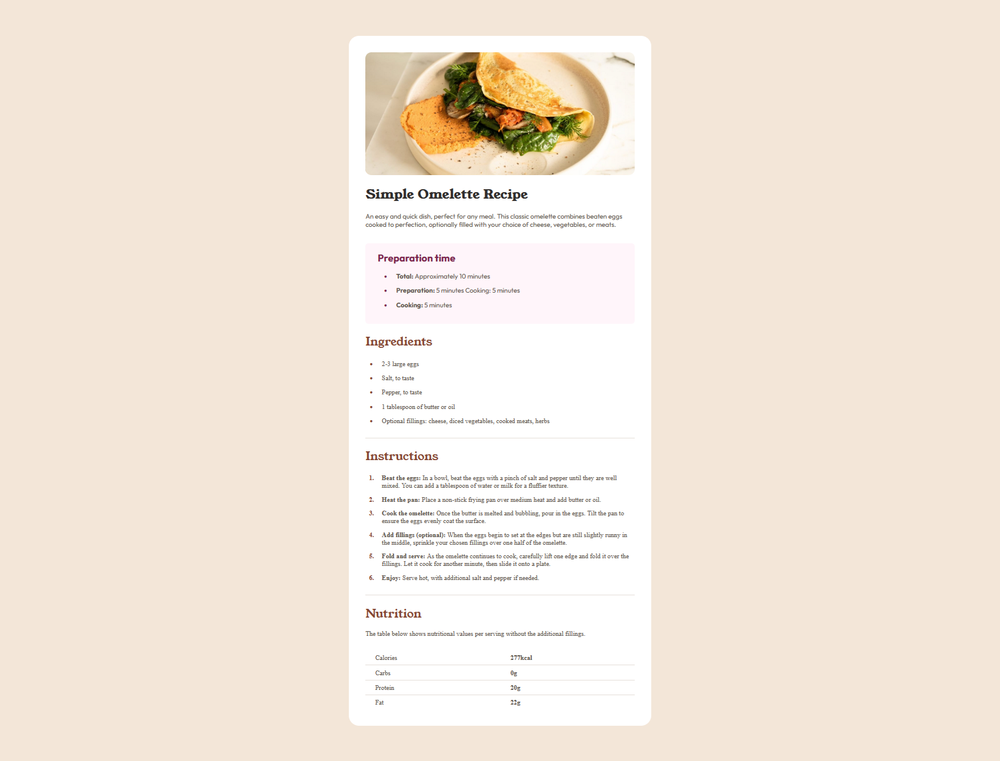
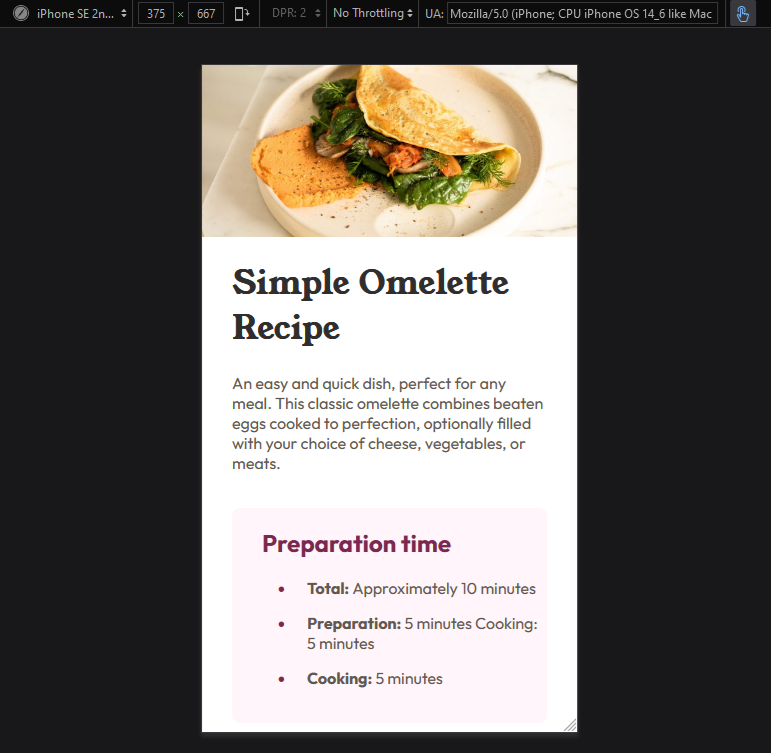

# Frontend Mentor - Recipe page

This is a solution to the [Recipe page challenge on Frontend Mentor](https://www.frontendmentor.io/challenges/recipe-page-KiTsR8QQKm). Frontend Mentor challenges help you improve your coding skills by building realistic projects.

## Content

- [Screenshot #1 (PC version)](#PC-screenshot)
- [Screenshot #2 (Mobile version)](#Mobile-screenshot)
- [Project Link](#Link)
- [Author Frontend Mentor profile](#Author)

### PC-Screenshot

### Mobile-screenshot

### Link

Live Site Link: 

### Author

- Frontend Mentor - [@Yaroslav Petrov](https://www.frontendmentor.io/profile/PetyaBiszeps)

## Thank you for challenges you provide for newcomers to train their skills <3

I have not used any frameworks since I feel it's essential to have complete understanding of fundamentals both HTML and CSS gives, so I decided to go for non-framework project.

While working on this project I have learnt a lot. Being honest, it gave me some essential skills and understanding of some easy coding. Some new commands and methods, 
like for any newcomers I guess ;)

I used some new solutions and methods I have never used before this project like "table" in HTML and @media in CSS. Had some practice with flexbox which is very good 
and important for anyone working within web. The most uncommon thing for me was trying to change content to make it look good on mobile.

Second really useful skill I got essential understanding of is git. What is git, how it works and how to create repositories.

I would strongly recommend anyone who tries to learn HTML and CSS from scratch to complete this project, firstly, because it gives you fundamentals knowledge and practice!